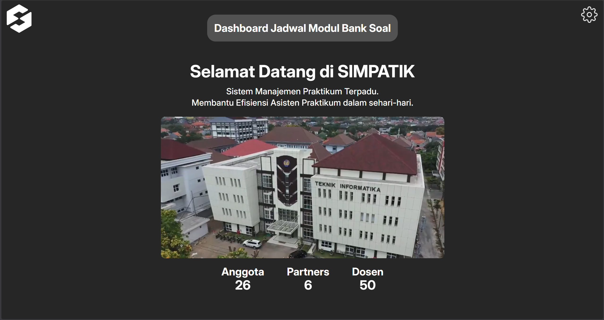
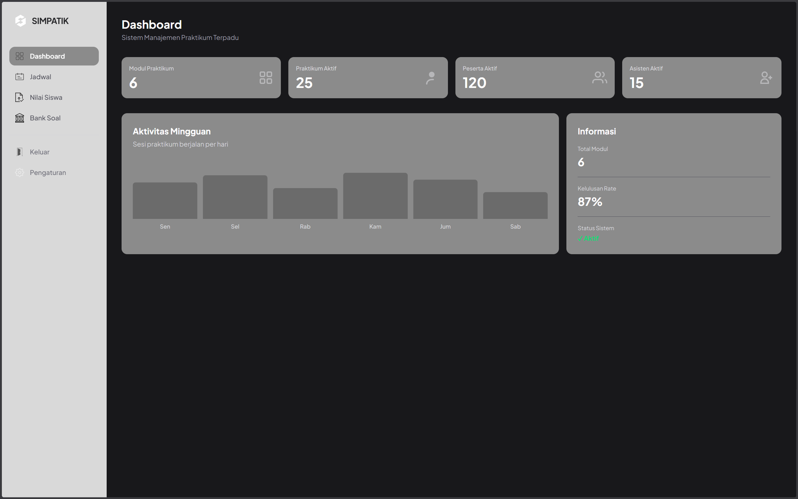
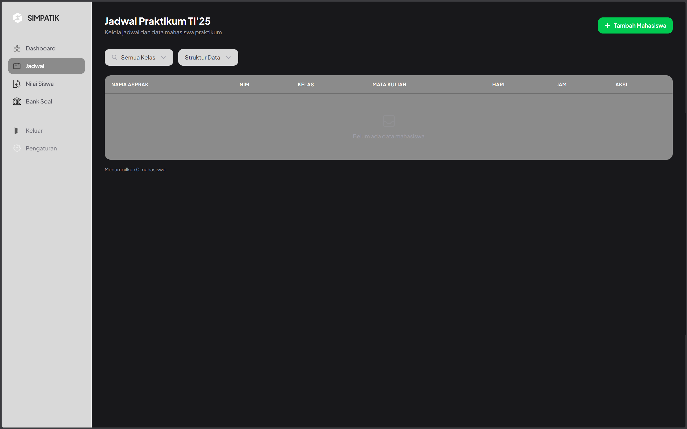
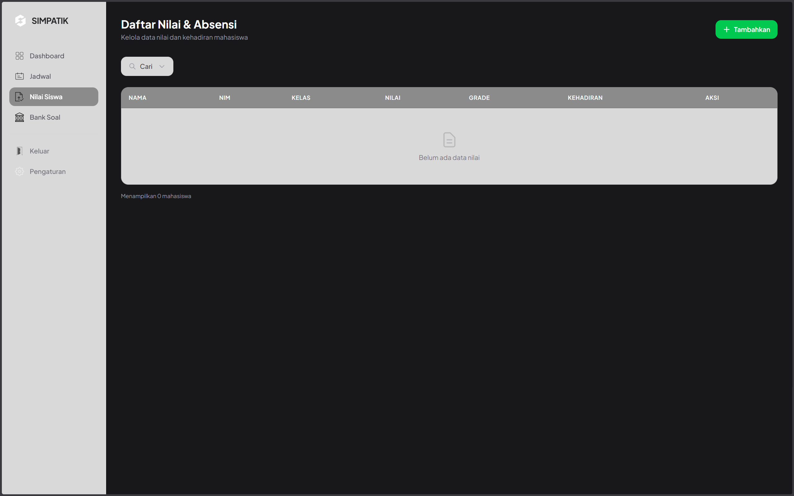
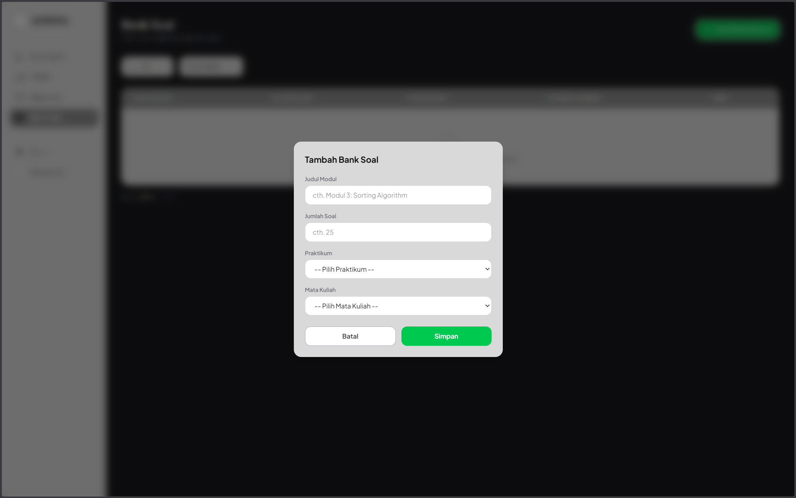

# Sistem Manajemen Praktikum Terpadu (SIMPATIK) 


SIMPATIK is a simple practicum management system developed for the Software Engineering course (RPL). It features a basic dashboard for teaching assistants and includes several core functionalities such as grade input, module management, and practicum scheduling.

> Please note that this project is still relatively simple, as it was developed as an implementation of the Waterfall SDLC methodology and serves primarily as a basic full-stack practice project.

## Features ✨
* Practicum Schedule Management
* Module Input & Management
* Simple and Clean UI
* Basic CRUD Functionality
* Grade Input System
* And many more! 🚀

## Contributors 🧑‍💻
- Alan — Login & Register Page, Integration to Front-End
- Davin — Home Page & Dashboard
- Hamzah — Schedule Page, Frontend & Backend Integration, Database Management, Main Project Lead
- Neza — Module Page
- Reihan — Grade Input

## Installation & Setup 🧑‍🏫

Make sure you already have these installed:

- XAMPP / Laragon (Apache + MySQL)
- Composer
- Node.js & NPM
- PHP
- Laravel

### Backend Setup (Laravel) 🔙

```bash
cd C:/xampp/htdocs/Simpatik

composer install
cp .env.example .env

php artisan key:generate
php artisan migrate
php artisan serve
```

### Frontend Setup 🚪
```
cd C:/xampp/htdocs/Simpatik

npm install
npm run dev
```

### Open in Browser
```
http://127.0.0.1:8000
```

### License

This project is licensed for personal and non-commercial use only.
Commercial use requires permission from the author.





